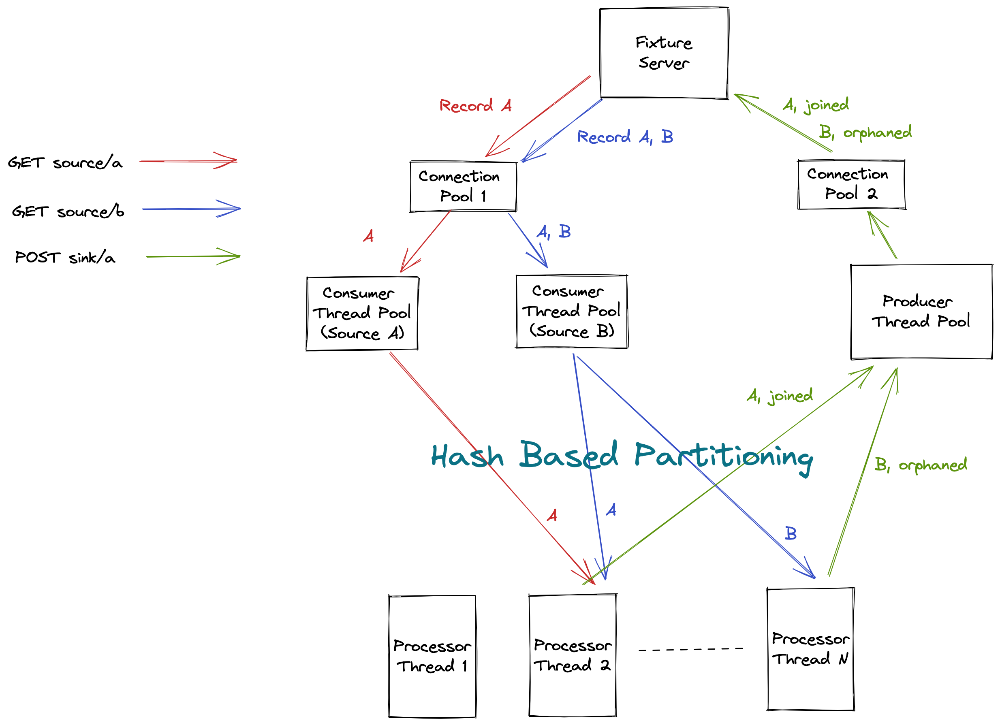

Solution
================
## How to run?
* chmod u+x run
* ./run

## Design


## Approach
* Using thread pools to improve throughput to consume records from source and to produce records to sink
* Partitioning records using modulo operation to ensure record lands to same processor thread. Doing this to avoid synchronisation issues specific to a record
* Each processor thread maintains state about each record it processes. If it sees another record which is already existing with it, then it will send it to producer threads as a joined record
* When all records are read from a source say, A, all the records maintained so far for the other source, B, by a processor thread is flushed to sink as orphaned records. From this point on, any record received by processor thread from source A are not storead any more but are directly sent to sink as an orphaned node
* When both the sources are read completely, then within 15 sec time, I am trying to send any pending orphaned records to the sink. These 15 seconds is what for which I tried to optimise heavily. I profiled the application and found that latency for Get and Post call from source and to sink is minimum (~6ms) when all thread pools are of size one. So I have optimized as per my machine.
* There are some configurations in [ExecutionContext](src/main/java/org/raisin/fixture/ExecutionContext) file which can be tweaked accordingly to increase performance for larger datasets
  * consumerThreadPoolSize - No of threads which will fetch records concurrently per source (usually it works best as the number of cores in a machine)
  * producerThreadPoolSize - No of threads which will push records concurrently to sink
  * processorThreads - No of threads which will concurrently process records received by consumer threads

## Improvements
* Fixture server can support HTTP/1.1 so that connection persistence can be used. Currently due to missing 'Content-Length' header and protocol version being HTTP/1.0, new sockets are being created for every call which is expensive
* I have made the relevant changes in [fixture_3.py.bak](fixture_3.py.bak) file

## Benchmarking
### Machine Specification
  * 2 core machine
  * Application memory - 256 MB
### Without server improvements
  * I have tested this with 80K size dataset successfully
  * On an average the job takes approximately 9 minutes to finish
### With server improvements
  * I have tested this with 150K size dataset successfully
  * On an average the job takes approximately 16 minutes to finish

Coding Challenge
================
First notes about your program:

* It has to produce the right results.
* Take your time, there is no hard timebox for this challenge, but normally it is developed around four hours. We don't consider the time you take to polish your submission's documentation to be part of the challenge's time limit.
* You can use the programming language of your choice to solve the challenge, as long you provide instructions on how to execute it, nevertheless using a language related to the position your are applying for, is a good idea.
* The code doesn't have to be perfect, but you need to be able to explain how things could be improved. (e.g., you could note that, "I'm not checking the return value here")
* We want you to make your own choices and we expect you to be able to explain any choices or assumptions you made.
* You can make those explanations in the comments.
* If you have any questions, feel free to contact us at techchallenge@raisin.com


Submission
==========
Once you are done, please send a **merge request** to this repository with your solution, along with instructions for building and running it.  
**please do not fork or share your solution as a public repository** 


Problem Description
===================

We have supplied you with a small web server called fixture. It is written in Python, we offer two versions:

* fixture_2 will run with Python 2.6 or Python 2.7, while
* fixture_3 will run with Python 3.6 or newer.

Pretty much any Unix based system will work (e.g. Linux or a Mac.)  You can probably even use a Windows if you want, but the verification tool may not work.

By default the web server listens on port 7299.

The web server has three endpoints:

* /source/a
    * emits JSON records.
* /source/b
    * emits XML records.
* /sink/a
    * accepts JSON records.

Most records from Source A will have a corresponding record from Source B, these are "joined" records.

Some records from one source will not have a match from the other source, these are "orphaned" records.

Some records are malformed, these are "defective" records.

Each source will emit each record ID either 0 or 1 times.

Your program must read all the records from `/source/a` and `/source/b`, categorize them as "joined", "orphaned", or "defective".

It must report the "joined' and "orphaned" records to `/sink/a`, It can ignore defective records, the ordering in which records are submitted is not important.

By default the test program will emit around 1000 records, once all the records have been read from an endpoint it responds with a "done" message.

You must start sending data before the endpoints are done.

In testing we will run your program against a much larger data set, so your program must behave as if it is going to run forever.

**Here's the catch**: Both sources and the sink endpoints are interlinked. Sometimes an endpoint will block until data has been read from or written to the other endpoints, when this happens the request will return a 406 response.  The program will never deadlock.


Testing
=======
The web server writes your responses and the expected response into its running directory, we supply a program to compare the these two files.

When we receive your program, we will run it against a much larger data set, you should test your program with a larger data set too.

Refer to the **How To Use The Tools** section for more details.


Message Specifications
======================

Endpoint `/source/a`
------------------

normal record:

    { "status": "ok", "id": "XXXXX" }

done record:

    {"status": "done"}

Endpoint `/source/b`
------------------
normal record:

    <?xml version="1.0" encoding="UTF-8"?><msg><id value="$ID"/></msg>

done record:

    <?xml version="1.0" encoding="UTF-8"?><msg><done/></msg>

Endpoint `/sink/a`
----------------
To endpoint in POST body:

    {"kind": "$KIND", "id": "$ID"},

where

* `$KIND` can be either "joined" or "orphaned", and
* `$ID` is the id from the originating messages.

Success response:

    {"status": "ok"}

Failure response:

    {"status": "fail"}


How To Use The Tools
====================

* Execute the web server. This mostly depends on your environment and the version you want to run.
    - In most cases, you'll run the server with

        ```
        cd be-challenge/
        ./fixture_3.py
        ```

    - If you're using MacOS Mojave or older and don't have a custom python3 install, you should run the version for python2

        ```
        cd be-challenge/
        ./fixture_2.py
        ```

  - If previous commands failed, read the documentation of the python version installed in your system.

* By default the fixture emits 1000 records. You can choose the number of records with `-n COUNT` option.  E.g. ` ./fixture_3.py -n 50000`

* The fixture server terminates fifteen (15) seconds after both sources are done.

* When the fixture terminates it will print a set of counters. These values may be useful to you.

* The output will appear in the files `submitted.txt` and `expected.txt` in the fixture's execution directory.

* Compare the `submitted.txt` and `expected.txt` files by executing:
    ```
    sh check.sh
    ```

* If all the records match, the comparison program will terminate with the message `good` and exit code `0`.

* If there are differences between the expected and submitted records
  then it prints a diff.
    * The expected records appear after the lines starting with `<`.
    * Your records appear after the lines starting with `>`.
    * After printing the diff, it prints `bad` and terminates with exit code `1`.


Final note
==========

**We will test it against a much larger dataset,** so you might want to try the fixture out with the `-n` option.

Use the opportunity to show your development skills especially if you are applying as senior developer. Simplicity is beauty.


Good luck!

